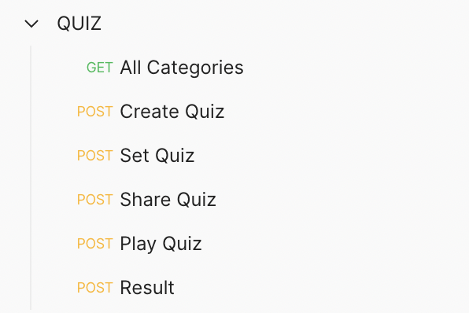

# Quiz Application

Its a simple and fun to use application.
You can make your own quizes and send the lik of the quiz to your friends.
When they would answer the quiz, you can get to know thier score.
This would help you and your friends to know each other better.
Later they can also make thier own quizes and share.
Lets see who knows you better.

Project Inspired from : https://funtriviaquiz.com


## Author - Atharva Parkhe

- Github - [atharvparkhe](https://www.github.com/atharvparkhe/)
- LinkedIn - [Atharva Parkhe](https://www.linkedin.com/in/atharva-parkhe-3283b2202/)
- Instagram - [atharvparkhe](https://www.instagram.com/atharvparkhe/)
- Twitter - [atharvparkhe](https://www.twitter.com/atharvparkhe/)

## Features

- Create Quizes.
- Set your own answers for the quiz.
- Share Quiz to friends via share link.
- Rank friends based on thier score.
- Answer Quizes made by others.


## Tech Stack

**Backebd:** Django *(Python)*

**Frontend:** ReactJS *(Java-Script)*

## Run Locally

***Step#1 :*** Create Virtual Environment

```bash
  virtualenv env
```

***Step#2 :*** Activate Virtual Environment

```bash
  source env/bin/activate
```

***Step#3 :*** Clone the project

```bash
  git clone https://github.com/atharvparkhe/quiz.git
```

***Step#4 :*** Go to the project directory

```bash
  cd quiz
```

***Step#5 :*** Install dependencies

```bash
  pip install -r requirements.txt
```

***Step#6 :*** Make Migrations

```bash
  python3 manage.py makemigrations
  python3 manage.py migrate
```

***Step#7 :*** Run Server

```bash
  python3 manage.py runserver
```

Check the terminal if any error.

## Documentation

The docs folder contain all the project documentations and screenshots related the project.

Postman Endpoints - https://www.getpostman.com/collections/663e33802f2cebea5827

**ENDPOINTS**



## Demo

Youtube Tutorial - I will upload tutorial video soon. Stay Tuned.