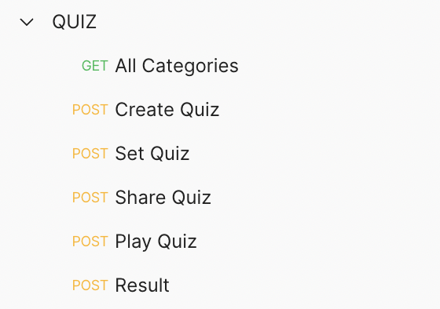
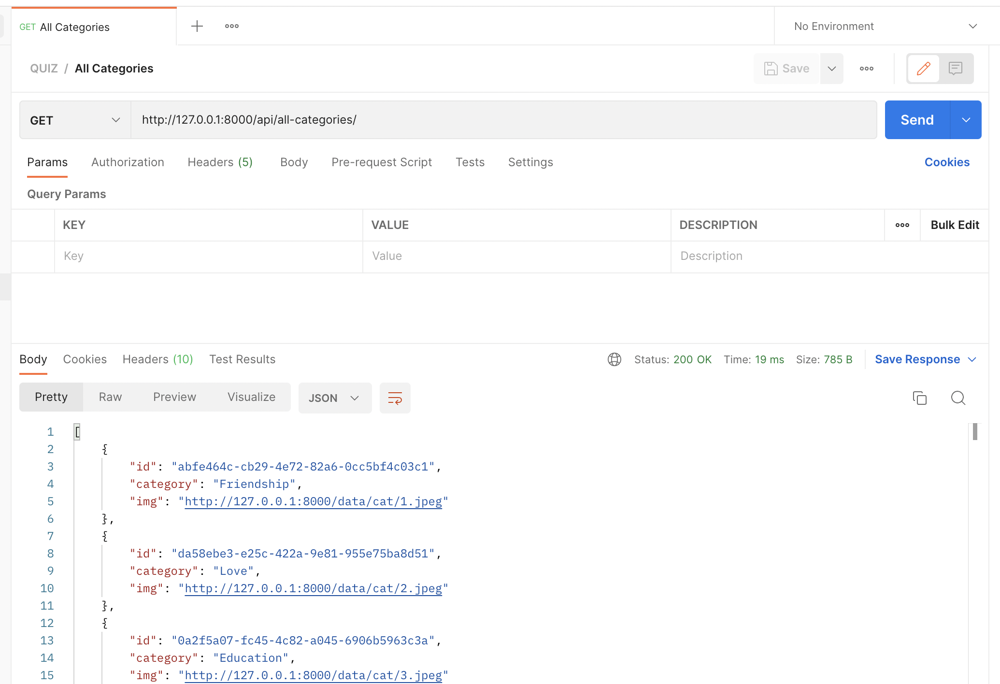
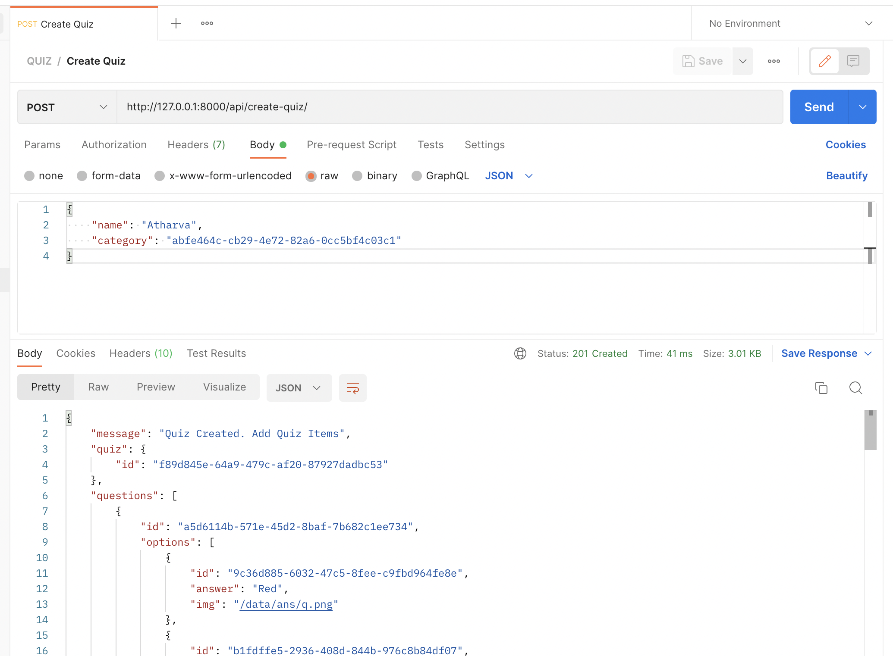
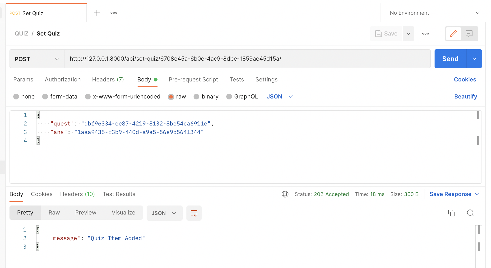
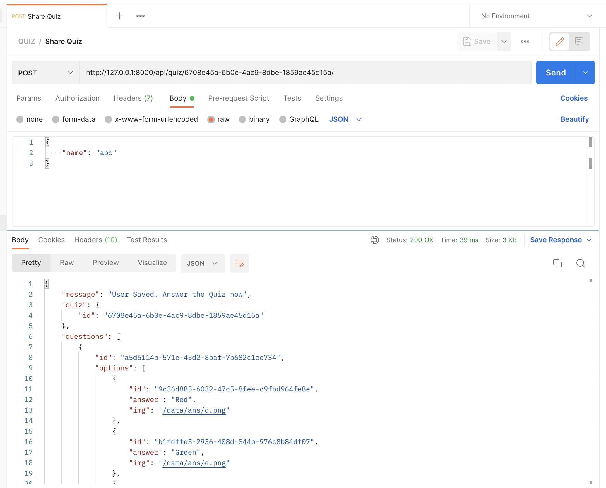
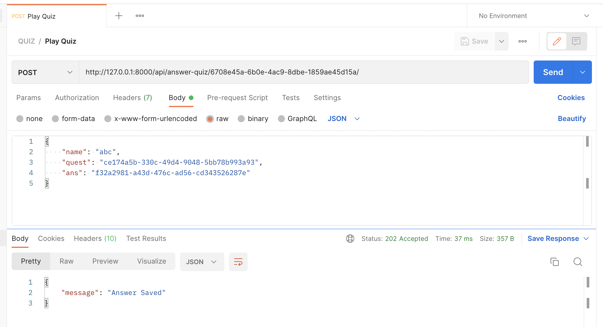
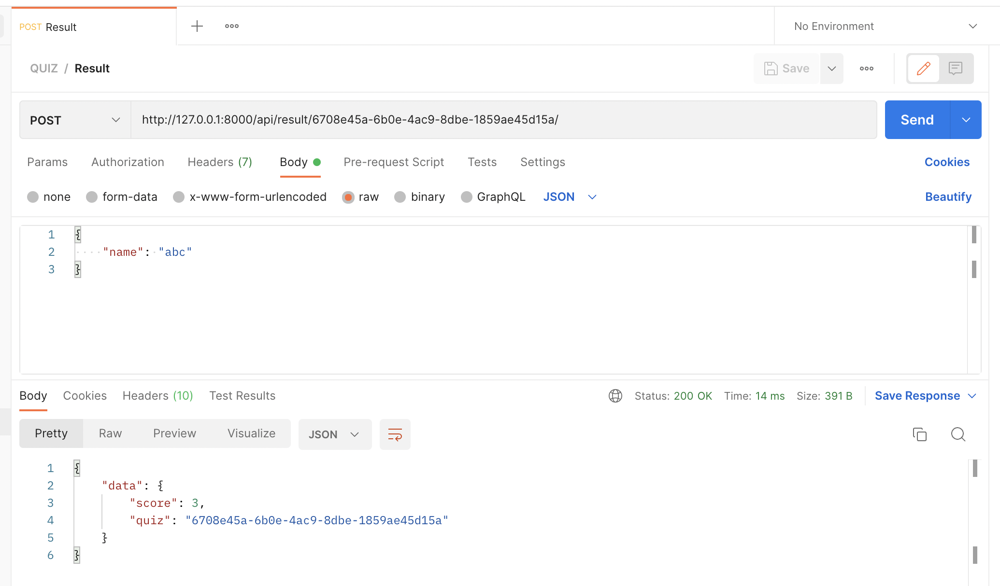

## Quiz Application

Its a simple and fun to use application.
You can make your own quizes and send the lik of the quiz to your friends.
When they would answer the quiz, you can get to know thier score.
This would help you and your friends to know each other better.
Later they can also make thier own quizes and share.
Lets see who knows you better.

Project Inspired from : https://funtriviaquiz.com


### 🔗 Content

- [Overview](#quiz-application)
- [Content](#-content)
- [Features](#-features)
- [Tech Stack](#-tech-stack)
- [API Reference](#-api-reference)
- [Run Locally](#-run-locally)
- [Documentation](#-documentation)
- [Screen-Shots](#-screen-shots)
- [Author](#-author)


### 📋 Features

- Create Quizes.
- Set your own answers for the quiz.
- Share Quiz to friends via share link.
- Rank friends based on thier score.
- Answer Quizes made by others.


### 🧰 Tech Stack

- **`BACKEND`** : Django *(Python)*

- **`DATABASE`** : SQLite3


### 🛠 API Reference

**Postman Endpoints** : https://www.getpostman.com/collections/663e33802f2cebea5827



**API Endpoints JSON file** (for importing into thunderclient / postman) is available in the docs folder or click [here](docs/endpoints.json)


### 💻 Run Locally

***Step#1 : Clone Project Repository***

```bash
git clone https://github.com/atharvparkhe/quiz-application.git && cd quiz-application
```

***Step#2 : Create Virtual Environment***

* If *virtualenv* is not istalled :
```bash
pip install virtualenv && virtualenv env
```
* **In Windows :**
```bash
env/Scripts/activate
```
* **In Linux or MacOS :**
```bash
source env/bin/activate
```

***Step#3 : Install Dependencies***

```bash
pip install --upgrade pip -r requirements.txt
```

***Step#4 : Run Server***

```bash
python manage.py runserver
```

*Check the terminal if any error.*


### 📄 Documentation

The docs folder contain all the project documentations and screenshots of the project.

**Local Server Base Link :** http://localhost:8000/

**Admin Pannel Access :**
- ***Email :*** "admin@admin.com"
- ***Password :*** "password"


### 🌄 Screen-Shots








### 🙋🏻‍♂️ Author

**🤝 Connect with Atharva Parkhe**

[](https://www.linkedin.com/in/atharva-parkhe-3283b2202/)
[](https://www.github.com/atharvparkhe/)
[](https://www.twitter.com/atharvparkhe/)
[](https://www.instagram.com/atharvparkhe/)
[](https://leetcode.com/patharv777/)
[](https://www.youtube.com/channel/UChimOJO64hOqtE7HCgtiIig)
[](https://discord.gg/8WNC43Xsfc)
